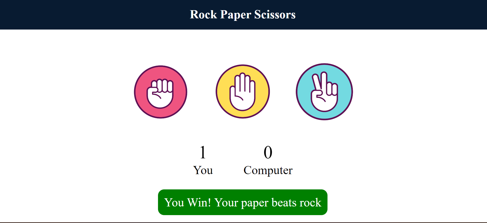
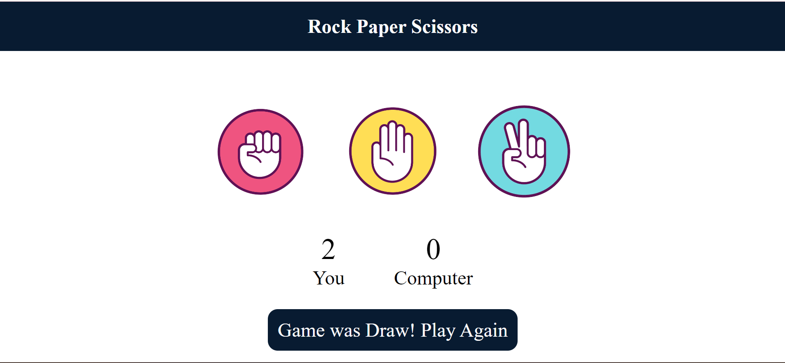
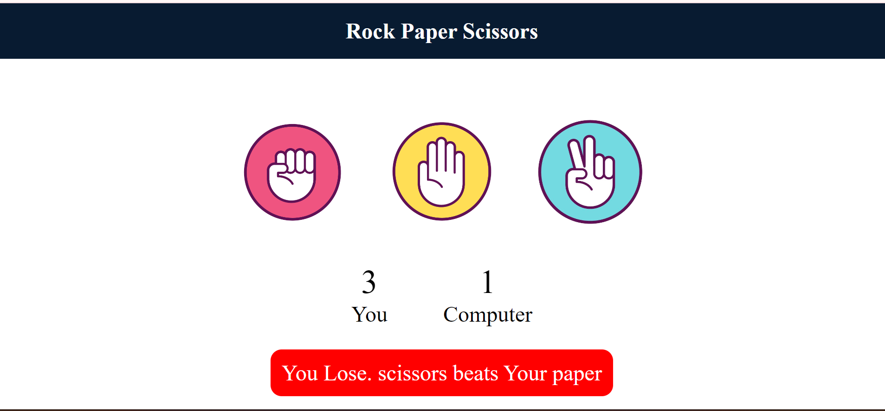

# Rock, Paper, Scissors Game

## Overview

This project is a simple implementation of the classic Rock, Paper, Scissors game. It allows a user to play the game against the computer, with the computer randomly selecting its moves.

## Table of Contents

- [Overview](#overview)
- [Features](#features)
- [Installation](#installation)
- [Usage](#usage)
- [Contributing](#contributing)
- [Screenshots](#screenshots)

## Features

- Play Rock, Paper, Scissors against the computer
- Randomized computer moves
- User-friendly interface
- Displays the results of each round

## Installation

1. Clone the repository:
    ```sh
    git clone https://github.com/yourusername/rock_paper_scissors.git
    ```
2. Change to the project directory:
    ```sh
    cd rock_paper_scissors
    ```
3. Install the required dependencies:
    ```sh
    pip install -r requirements.txt
    ```

## Usage

1. Run the game script:
    ```sh
    python rock_paper_scissors.py
    ```
2. Follow the on-screen instructions to play the game.

## Contributing

We welcome contributions to improve this project. Please fork the repository and submit a pull request with your changes.

## Screenshots





